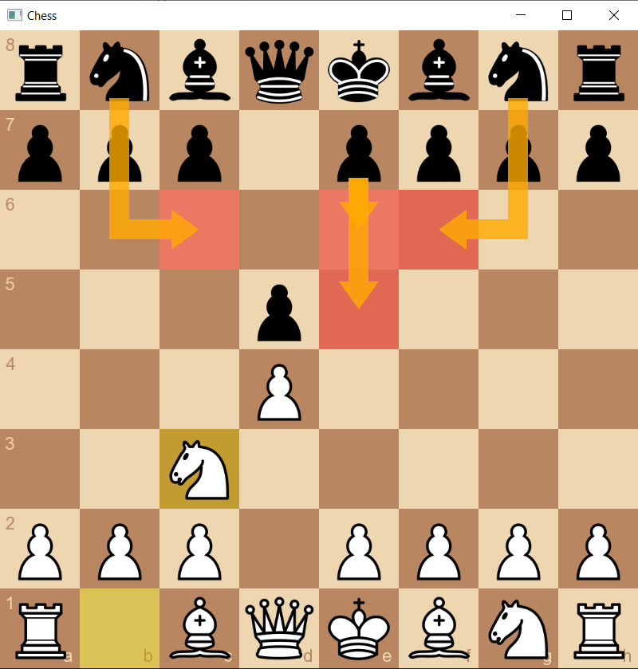

# exlib

**exlib** is a lightweight, modern C++ graphics library built on top of OpenGL. It provides utilities for window management, event handling, graphics, and OpenGL interfaces.

## Features

-   Easy creation and control of windows
    
-   Input event management (e.g., key presses and mouse movements)
    
-   Basic graphics interfaces
    
-   Texture rendering support

-   Text rendering (support different fonts, text size and style)

-   Cross-platform compatibility (Windows & Linux)
    

## Examples

The examples are in the `exlib/examples` directory:

| Example | Description                                                                                                                                         | Screenshot                                                                 |
|---------|-----------------------------------------------------------------------------------------------------------------------------------------------------|----------------------------------------------------------------------------|
| chess   | Uses most of the functions in this library. Supports piece movement (via selection or dragging), and right-click to mark (highlight squares, draw arrows). |  |

For more references, see the `exlib/tests` directory, which contains usage examples for all functions in this project.

## Getting Started

### Prerequisites

-   A C++17 compatible compiler (e.g., GCC, Clang, MSVC)
    
-   CMake 3.5 or higher
    

### Clone the Library

```bash
git clone --recurse-submodules https://github.com/YunTianZhou/exlib.git
cd exlib
```

## Usage

We recommend you use CMake to build your project, you can find the CMake template below.
You can also choose to compile this library and link against it ([build exlib](#build)).

### CMake Template
```cmake
cmake_minimum_required(VERSION 3.5)
project(ExlibExample)

set(CMAKE_CXX_STANDARD 17)
set(CMAKE_CXX_STANDARD_REQUIRED ON)

include(FetchContent)

FetchContent_Declare(
    exlib
    GIT_REPOSITORY https://github.com/YunTianZhou/exlib.git
    GIT_TAG 1.0.0
)

FetchContent_MakeAvailable(exlib)

add_executable(main_app main.cpp)

target_link_libraries(main_app PRIVATE exlib_static)
```

### Example code
```cpp
#include <exlib/exlib.hpp>

int main() {
    ex::Window& window = ex::Window::create(ex::Vec2i{ 800, 600 }, "Hello Exlib");

    if (!window.is_exist())
        return -1;

    while (window.is_open()) {
        window.clear();

        // Draw something here
        // ex::Draw::draw(...)

        window.display();
        window.poll_events();
    }

    window.destroy();
}
```

## Build

You can build the project using either standard CMake commands or a convenient wrapper script.

### Option 1: Manual CMake Invocation

#### 1. Configure the build

```bash
cmake -B build -S . \
  -DBUILD_STATIC=<ON|OFF> \
  -DBUILD_SHARED=<ON|OFF> \
  -DBUILD_TESTS=<ON|OFF> \
  -DBUILD_EXAMPLES=<ON|OFF> \
  -DLINK_SHARED=<ON|OFF>
```
    
-   `BUILD_STATIC` (default: ON) — whether to build the static library
    
-   `BUILD_SHARED` (default: ON) — whether to build the shared library

-   `BUILD_TESTS` (default: OFF) — whether to build the test suite

-   `BUILD_EXAMPLES` (default: OFF) — whether to build the example suite

-   `LINK_SHARED` (default: OFF) — whether to link tests and examples against the shared library (static library as default)
    

You can change the options or CMake configs according to your needs.

#### 2. Build the project

```bash
cmake --build build --config <Release|Debug>
```

### Option 2: Use the Wrapper Script

A script is provided to simplify the build process. Just run:

```bash
scripts/build.sh [options]
```

It will generate a build directory at the project root (`exlib/build`), including the generated binaries.

#### Script options

```
    -c, --config         Debug | Release         (default: Release)
                         Build type passed to CMake (CMAKE_BUILD_TYPE)
  
    -t, --tests          ON | OFF               (default: ON)
                         Enable or disable building of tests

    -e, --examples       ON | OFF               (default: ON)
                         Enable or disable building of examples
  
    -l, --link-shared    ON | OFF               (default: OFF)
                         Link tests and examples with shared (ON) or static (OFF) library

    -g, --generator      <name>                 (default: system default)
                         CMake generator to use (e.g. "Ninja", "Unix Makefiles", "Visual Studio 17 2022")
```

#### Example usage

This sets up a Debug build, disables tests, and uses Ninja to build:

```bash
scripts/build.sh --config Debug --tests OFF --generator "Ninja"
```

To use the default settings: Release build, tests & examples ON and link with static library, and the default generator (e.g., Unix Makefiles or Ninja if available):

```bash
scripts/build.sh
```

## Acknowledgments

This project utilizes the following open-source libraries:

-   [glfw](https://github.com/glfw/glfw) - Multi-platform library for OpenGL
    
-   [glew](https://github.com/nigels-com/glew) - The OpenGL Extension Wrangler Library
    
-   [glm](https://github.com/g-truc/glm) - OpenGL Mathematics
    
-   [stb](https://github.com/nothings/stb) - Image import and export

-   [freetype](https://github.com/freetype/freetype.git) - Load font
    

This project is inspired by the design of the `Graphics` module in [SFML](https://github.com/SFML/SFML).
